# Der Designer

## Voreinstellungen

### Programmstart

Starten Sie den Confire Blackboard Designer über den entsprechenden Eintrag im Windows-Startmenü `Start > STÜBER SYSTEMS > Confire Blackboard Designer`. Wenn Sie zum ersten Mal mit Confire Blackboard arbeiten, sollten Sie über die runde Blackboard-Schaltfläche oben links `Blackboard-Button > Öffnen` eine der mitgelieferten Beispieldateien öffnen. Die Beispieldateien enthalten die gleichen Layouts und unterscheiden sich lediglich in der Auflösung des Zielbildschirms (Public Displays), für die sie erstellt wurden:

* Datei „Beispiel 1920x1080.blackboard“
* Datei „Beispiel 1366x768.blackboard“
* Datei „Beispiel 1360x768.blackboard“
* Datei „Beispiel 1280x800.blackboard“

Wir werden in den weiteren Abschnitten dieses Kapitels auf die Beispieldatei „Beispiel 1920x1080.blackboard“ Bezug nehmen, die für die Auflösung 1920x1080 Bildpunkte erstellt wurde.

Im Designer erstellen Sie Layouts für einen Zielbildschirm, auf dem das Layout später angezeigt werden soll. Ein Layout ist sozusagen ein anfangs leerer Bildschirm, den Sie durch Hinzufügen von Bildern, Texten, Animationen und Videos mit Inhalten füllen. Wann das Layout auf dem Zielbildschirm angezeigt wird, können Sie im Zeitplan festlegen.

### Die Auflösung des Zielbildschirms festlegen

Bevor Sie mit der Erstellung neuer Layouts beginnen, müssen Sie die Bildschirmauflösung des Public Displays einstellen, auf dem die Präsentation nachher abgespielt bzw. angezeigt werden soll. Das entsprechende Dialogfenster können Sie über `Blackboard-Button > Eigenschaften` aufrufen.
 
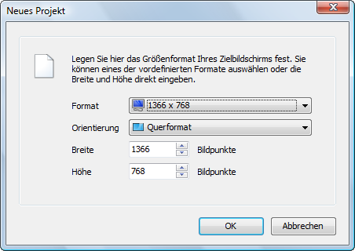

Die Projekte müssen beim Anlegen für die Auflösung des Zielbildschirms eingerichtet werden. In anderen Worten: Wenn Sie die Präsentation auf zwei Monitoren mit unterschiedlicher Auflösung anzeigen wollen, müssen Sie zwei getrennte Projekte erstellen. Am besten geht das, indem sie die Präsentation für den Bildschirm mit der höchsten Auflösung erstellen. Anschließend kopieren Sie die Projekt-Dateien, stellen die niedrigere Auflösung ein und korrigieren die Layouts entsprechend.

> #### info::Hinweis
>
> Wenn Sie Public-Displays mit unterschiedlichen Bildschirmauflösungen verwenden, sollten Sie die Präsentation an jede Bildschirmauflösung entsprechend anpassen, d.h. Sie verwenden für jede Auflösung eine eigene Projektdatei. 

## Das Programmfenster des Designers
 
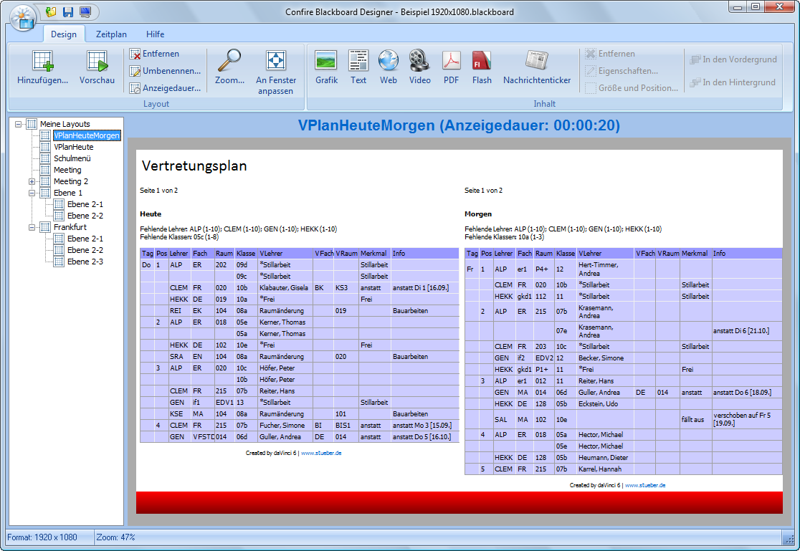

Das Programmfenster des Confire Blackboard Designers besteht aus drei verschiedenen Ansichten, die jeweils die verschiedenen Tätigkeiten bei der Erstellung von Präsentationen zusammenfassen. Sie können zwischen diesen drei Ansichten mit Hilfe der Registerkarten „Design“, „Zeitplan“ und „Hilfe“, die sich ganz oben im Programmfenster, oberhalb des Menübandes befinden, wechseln. Der Bereich „Design“ dient der Gestaltung Ihrer Präsentationen, im Bereich „Zeitplan“ legen Sie auf Wunsch zusätzlich fest, welche Teile Ihres Projektes zu welchem Tag oder welcher Tageszeit angezeigt werden sollen, und der Bereich „Hilfe“ dient Information über das Programm selbst. 

## Präsentationen erstellen

Das Erstellen einer Präsentation beginnt mit Anlegen von „Layouts“ also zunächst leeren Präsentations-Bildschirmen, denen anschließend Inhalte hinzugefügt werden. Diese Tätigkeit spielt sich im Hauptfenster der Ansicht „Design“ des Confire Blackboard Designers ab. Hier werden die einzelnen Layouts, aus denen das aktuelle Projekt besteht, angezeigt und können bearbeitet werden. In der obigen Abbildung wird gerade das Layout für den Vertretungsplan einer Schule „VPlanHeuteMorgen“ angezeigt. Oberhalb des Hauptfensters finden Sie das Menüband mit den Bereichen „Layout“ und „Inhalte“. Der Bereich „Layout dient dem Anlegen, Löschen und Organisieren von Layouts, der Bereich „Inhalte“ dient dem Hinzufügen und Organisieren von Inhalten innerhalb des gerade bearbeiteten Layouts. Links neben dem Hauptfenster wird der sog. Projektbaum angezeigt. Unterhalb des Wurzel-Layouts „Meine Layouts“ verzweigt sich hier die Liste aller in diesem Projekt enthaltenen Layouts bzw. Unterlayouts.

### Ein Layout hinzufügen

Wenn Sie ein Layout zu Ihrem Projekt hinzufügen möchten, klicken Sie links auf das Layout, zu dessen Sequenz Sie das neue Unter-Layout hinzufügen möchten. Klicken Sie dann auf die Schaltfläche „Hinzufügen“. Um etwa im Beispielprojekt ein weiteres Layout „Berlin“ hinzuzufügen, klicken Sie auf „Meine Layouts“ und dann auf „Hinzufügen“. Die Reihenfolge der Layouts können Sie mit „Rechte Maustaste|Nach oben“ bzw. „Rechte Maustaste|Nach unten“ verändern. Per Drag & Drop können Sie zudem Sequenzen in Untersequenzen verschieben.

### Dem Layout Inhalte hinzufügen

Wie schon anfangs erwähnt, füllen Sie ein Layout mit Inhalten, indem Sie Bilder, Texte, Animationen bzw. Videos hinzufügen. Klicken Sie dazu in der Menügruppe „Inhalt“ jeweils auf den entsprechenden Button.
 
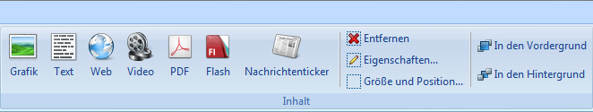

* „Grafik“, für Bilddateien (unterstützt werden die Formate .JPG, .PNG, .BMP)
* „Text“, für Textdateien (unterstützt werden die Formate .RTF, .TXT)
* „Web“, für Dateien aus dem Internet bzw. in entsprechenden Formaten (z.B. .HTML) 
* „Video“, für Videodateien (unterstützt werden die Formate .AVI, .WMV)
* „PDF“, für Acrobat Reader Dokumente (Dateiendung .PDF)
* „Flash“, für Flash-Animationen (Dateiendung .SWF)
* „Nachrichtenticker“, für RSS-Feeds aus dem Internet oder für Textdateien (Dateiendung .TXT)

Beim Einfügen der Inhaltsdateien können Sie für jede Datei entscheiden, ob Sie die Datei jeweils in das bestehende Projekt einbetten oder als externe Ressource nutzen möchten. Der Unterschied zwischen diesen beiden Möglichkeiten wird in den folgenden Abschnitten „Inhaltsdateien einbetten“ und „Inhaltsdateien als externe Ressource einbinden“ erläutert.

## Layouts in Sequenzen organisieren
 
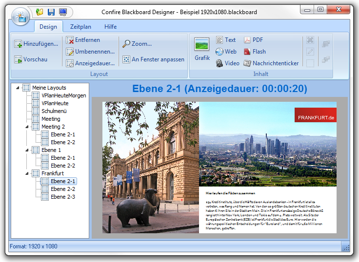

Mehrere im Projektbaum untereinander stehende Layouts bilden eine sog. „Sequenz“. Dabei ist prinzipiell für jedes Layout eine Anzeigedauer eingetragen, die im Hauptfenster neben dem Namen des gerade angezeigten Layouts angezeigt wird. Sie können die voreingestellte Anzeigedauer für jedes Einzellayout mit Hilfe des Menüpunktes „Anzeigedauer“ aus Menügruppe „Layout“ ändern, oder Sie doppelklicken einfach auf Schrift „Anzeigedauer“ in der Titelzeile des Hauptfensters, um dieses Menü zu erreichen. Startet man eine solche Sequenz, durch das Auswählen eines beliebigen Anfangspunktes und das Betätigen der Schaltfläche „Vorschau“, werden alle Einzellayouts entsprechend der jeweiligen Anzeigedauer nacheinander angezeigt, ganz ähnlich, wie Sie das vielleicht von „Playlisten“ in Ihrem MP3-Player kennen. 

Die hierarchische Organisation der Listen in Form eines Projektbaumes hat dabei einige Besonderheiten. Zunächst kann jedes Layout wiederum aus einer Sequenz von Unterlayouts bestehen usw. Sie können im Beispielprojekt der Abbildung sehen, dass das Layout „Frankfurt“ aus einer Sequenz der Unterlayouts „Ebene 2-1“, „Ebene 2-2“ und „Ebene 2-3“ besteht. Die Funktion „Vorschau“ wird, genau wie später der Confire Blackboard Player, alle Layouts nacheinander abspielen, die sich unterhalb des beim Betätigen des Abspielknopfes ausgewählten Start-Layouts befinden. Wählen Sie z. B. das Wurzellayout „Meine Layouts“ als Startpunkt aus, werden sämtliche in Ihrem Projekt enthaltenen Layouts abgespielt, weil sich logischer Weise alle unterhalb des Wurzellayouts befinden. Wählen Sie dagegen das Layout Frankfurt als Start-Layout zum Abspielen aus, werden nur die drei enthaltenen Unterlayouts „Ebene 2-1“, „Ebene 2-2“ und „Ebene 2-3“ nacheinander abgespielt, bis Sie die Anzeige unterbrechen.

## Inhalte in verschiedenen Ebenen organisieren

Das Layout „Frankfurt“ im gewählten Beispielprojekt zeigt auch die zweite Besonderheit der Organisation von Inhalten in hierarchischen Listen von Layouts im Projektbaum: Elemente wie Bilder oder Texte, die Sie in der übergeordneten Ebene „Frankfurt“ angelegt haben, werden auf allen unteren Ebenen (also „Ebene 2-1“, „Ebene 2-2“ und „Ebene 2-3“) mit angezeigt. Dies ist hilfreich, um oft angezeigte Inhalte nur einmal einfügen zu müssen. Wenn Sie hintereinander Layouts anzeigen möchten, die sich nur in Details unterscheiden, können Sie sich also Arbeit sparen, indem Sie mit Ebenen arbeiten. 
Ein Beispiel für Ebenen ist die Sequenz „Ebene 1“ des Beispielprojekts. Sie besteht aus dem Rahmen-Layout „Ebene 1“ und den beiden Detail-Layouts „Ebene 2-1“ und „Ebene 2-2“. Der Inhalt des Rahmen-Layouts mit dem Bildschirm links unten und dem Confire Blackboard Programmsymbol rechts oben erscheint als Hintergrundebene in jedem Detail-Layout.
 
Das Rahmen-Layout "Ebene 1" bildet die Hintergrundebene für die beiden Detailebenen bzw. Detail-Layouts "Ebene 2-1" und "Ebene 2-2".

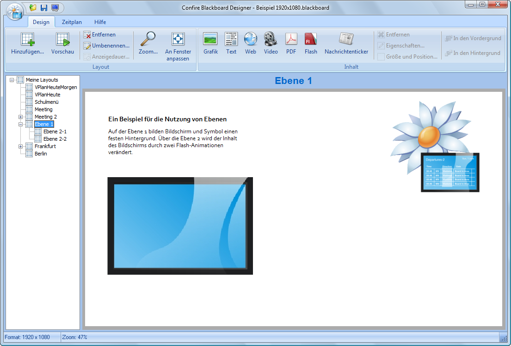
 
Die Flash-Animation mit den Krabbeltieren liegt auf der Detailebene "Ebene 2-1":

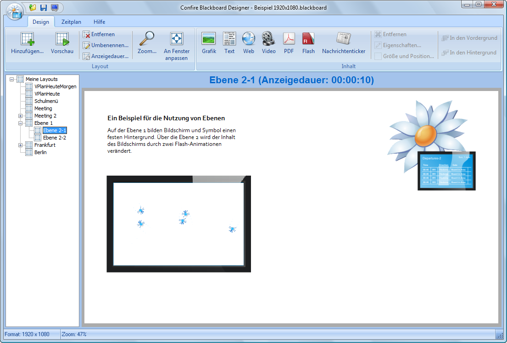

Die Flash-Animation mit dem Zeichenregen liegt auf der Detailebene "Ebene 2-2":

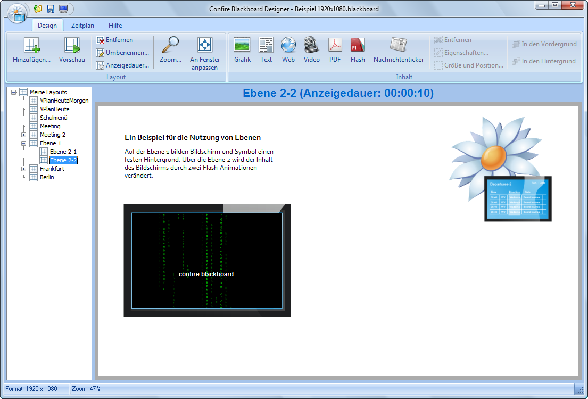

Ein weiteres Beispiel für die Verwendung von Ebenen ist die Sequenz „Frankfurt“ im Beispielprojekt. Dort liegt das Wolkenkratzer-Bild mit dem FRANKFURT.de Logo auf der Rahmen-Ebene. Die Detailbilder links und der Beschreibungstext rechts unten liegen auf den Detail-Ebenen „Ebene 2-1“, „Ebene 2-2“ und „Ebene 2-3“.

## Inhaltsdateien einbetten 
 
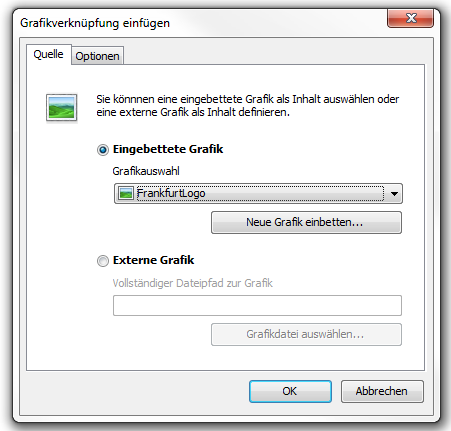
 
Wenn Sie Inhaltsdateien „einbetten“, wird zusätzlich zu Ihrer Projektdatei ein Projekt-Ordner angelegt, in den alle eingebetteten Inhaltsdateien kopiert werden. Sobald sie eine Inhaltsdatei (z. B. ein Bild oder ein HTML-Dokument) in Ihr Projekt eingebettet haben greifen der Confire Blackboard Designer und Player nicht mehr auf die Original-Datei auf Ihrer Festplatte zu (z. B. aus dem Verzeichnis „Meine Bilder“), sondern auf die Kopie im Projektordner. Auf diese Weise sind alle eingebetteten Inhaltsdateien übersichtlich in einem Verzeichnis zusammengefasst und Sie laufen nicht Gefahr, versehentlich Dateien, die Sie in Ihren Confire-Blackboard-Projekten verwendet haben, zufällig zu verschieben oder zu löschen.

Zum Zweiten können Sie auf diese Weise Confire-Blackboard-Projekte bequem auf andere Computer übertragen, ohne sich um die ursprünglichen Verzeichnispfade zu den eingebetteten Originaldateien zu kümmern. Es genügt hierzu die Blackboard-Datei und den Projektordner mit den Inhaltsdateien auf einen anderen Rechner kopieren. Umgekehrt bedeutet das Kopieren oder Weitergeben eines Projektes also stets, die Projekt-Datei mit der Dateiendung „.blackboard“ gemeinsam mit dem Projektordner mit der Endung „.contents“ zu kopieren, es sei denn Sie haben keine einzige Datei eingebettet. 

> #### info::Hinweis
>
> Bis auf die Endung tragen der Projektordner und die Projektdatei immer den gleichen Namen. Zu einer Projektdatei „Beispiel.blackboard“ gehört also der Projektordner „Beispiel.blackboard.contents“ und beide müssen beim Verschieben auch wie im gleichen Verzeichnis abgelegt werden.

Um Inhaltsdateien in das Projekt einzubetten, führen Sie bitte die folgenden Schritte aus:

1. Sofern Sie dies noch nicht getan haben, speichern Sie Ihr Blackboard-Projekt unter einem selbst gewählten Namen am gewünschten Ort.

2. Betätigen Sie eine der Schaltflächen zum Einbinden von Inhaltsdateien, z. B. die Schaltfläche „Grafik“.

3. Aktivieren Sie auf der Registerkarte „Quelle“ des erscheinenden Dialogfensters die Option „Eingebettete Grafik“.

4. Wählen Sie eine Grafik aus der Liste Grafikauswahl, in der Sie eine Liste Ihrer zuvor benutzen Grafiken finden, oder wählen Sie eine neue Grafik von Ihrer Festplatte, indem Sie die Schaltfläche „Neue Grafik einbetten“ betätigen.

5. Tragen Sie im erscheinenden Dialogfenster den Dateipfad der Grafik ein oder öffnen Sie mit Hilfe der Schaltfläche „Grafikdatei auswählen…“ einen Dateibrowser und wählen Sie eine Grafikdatei aus.

6. Bestätigen Sie Ihre Auswahl mit „OK“ bzw. abschließend ein weiteres Mal mit „OK“

Die eingebettete Grafik wird nun im Designer angezeigt. Die Funktion des Einbettens von Inhaltsdateien ist erst verfügbar, sobald Dateiname und Speicherort der Blackboard-Datei angegeben sind.

> #### info::Hinweis
>
> „Einbetten“ bedeutet, alle in Ihrem Projekt genutzten Dateien wie z.B. Bilder, HTML, Videos etc. in einem Ordner zusammenzufassen.

## Inhaltsdateien als externe Ressource einbinden
 
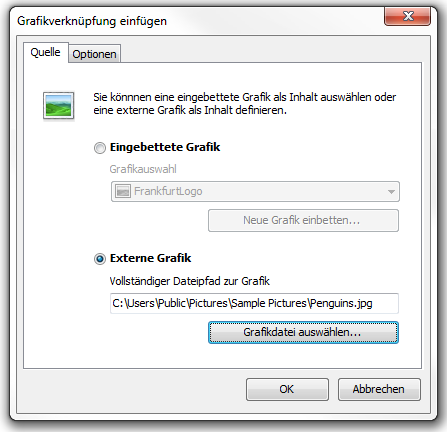

Wenn Sie eine Inhaltsdatei nicht „einbetten“, sondern als externe Ressource „einbinden“, laden der Confire Blackboard Designer wie auch der Player diese direkt aus dem beim Einbinden angegeben Verzeichnis, ohne eine Kopie im Projekt-Ordner anzulegen. Daher können nur solche Dateien als externe Ressourcen eingebunden werden, auf die sowohl der PC mit dem Designer, als auch der PC mit dem Confire Blackboard Player Zugriff haben. Es muss also bereits bei der Angabe des Pfades zur eingebundenen Datei im Confire Blackboard Designer berücksichtigt werden, dass der Player die Datei später unter dem angegeben Pfad abrufen kann. Dies gilt in der Regel nur für Dateien, die auf einem Server bzw. in einem freigegebenen Ordner im lokalen Netzwerk liegen, wie z. B. „www.tagesschau.de/nachrichtenticker“, „www.meinunternehmen.com/bilder/unser_logo.jpg“, oder „\\schulverwaltung\vertretungspläne\davinci\V_TK_001_1.html“.

Wegen dieser Voraussetzung ist die Arbeit mit „eingebetteten“ Dateien für einige Aufgaben einfacher als die mit „eingebundenen“ externen Dateien. Da eingebettete Dateien im Projektordner liegen, werden diese beim Weitergeben eines Projektes oder bei der Übertragung an die öffentlichen Bildschirme durch die Funktion „Veröffentlichen“ immer automatisch mitkopiert. Die Nutzung von externen Dateien hat allerdings auch Vorteile. Ein wichtiger Vorteil ist, dass es mit externen Dateien einfach zu realisieren ist, dass Inhalte aus externen Quellen dynamisch in die öffentliche Anzeige eingebunden werden, die nicht speziell für die Anzeige mit Confire Blackboard erstellt werden. Haben Ihre Public-Displays Internetzugriff, können Sie Ihrem Publikum z. B. stets aktuelle Wetterinformationen oder Nachrichten aus dem Internet anbieten, indem Sie einen externen RSS-Nachrichtenticker oder ein Flash-Wetterapplet einbinden. „Externe Inhalte“ müssen dabei nicht notwendig aus fremden Quellen stammen. Sie können genauso gut die auf der Webseite Ihrer eigenen Organisation bekanntgegebenen öffentlichen Neuigkeiten auf Ihren Public-Displays anzeigen, in dem Sie diese ohne Sie jeden Tag neu zu kopieren als externe Ressourcen einbinden. Das Gleiche gilt z. B. für das mit einem Office-Programm erstellte Tagesmenü eines Restaurants oder die aktuellen internen Vertretungspläne einer Bildungseinrichtung, solange diese im lokalen Netzwerk abgerufen werden können.

Solche Inhalte lassen Sich natürlich auch einfach und schnell in ein Layout einbetten, beim Einbinden als externe Ressource ist der Vorteil, dass die angezeigten Einzelinhalte sich verändern lassen, ohne dass Sie das entsprechende Layout anschließend ebenfalls aktualisieren müssen. Es reicht also, dass Ihr Küchenchef die RTF-Tabelle mit dem Speiseplan aktualisiert, oder Ihr Vertretungsplaner den Vertretungsplan aktualisiert. Die eingebundenen Inhalte werden im Gegensatz zu eingebetteten Inhalten jedes Mal neu für die Anzeige vom angegebenen Speicherort abgerufen. Hat sich dort etwas verändert, erscheint die Veränderung beim nächsten Durchlauf des Layouts sofort auf Ihren Bildschirmen.

Für welche Möglichkeit Sie sich entscheiden liegt in Ihrer Hand. Der etwas höhere Einrichtungsaufwand des Einbindens von Informationsquellen als externe Ressourcen rentiert sich in der Regel schnell, wenn aktualisierte Informationen die keine Änderungen der Präsentation erfordern, mehrfach täglich von unterschiedlichen Personen aktualisiert werden. 

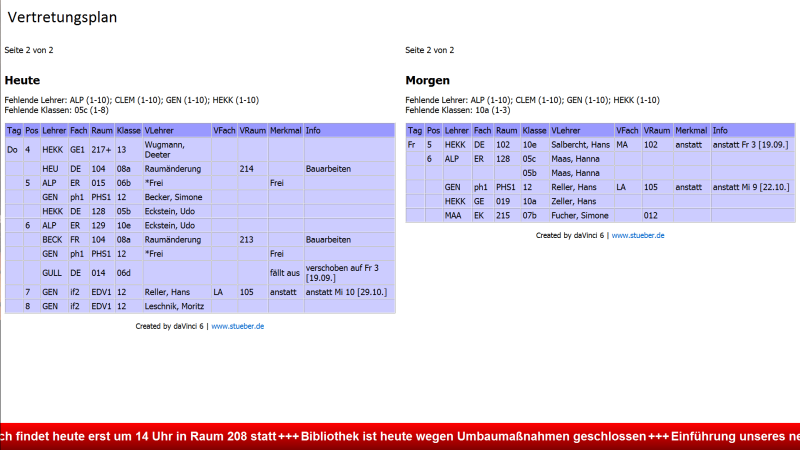

Um Inhaltsdateien als externe Ressource in das Projekt einzubinden, gehen Sie bitte folgendermaßen vor: 

1. Betätigen Sie eine der Schaltflächen zum Einbinden von Inhaltsdateien, z.B. die Schaltfläche „Video“.

2. Aktivieren Sie auf der Registerkarte „Quelle“ des erscheinenden Dialogfensters die Option „Externes Video“. 

3.	Betätigen Sie die Schaltfläche „Video-Datei auswählen“ und wählen Sie im erscheinenden Dateiexplorer die gewünschte Video-Datei. 

4.	Bestätigen Sie abschließend mit „OK“. 

Die eingebundene externe Videodatei wird nun im Designer angezeigt.

### Mehrseitige HTML-Dokumente aus DAVINCI einbinden oder einbetten

Sie können einem Layout auch mehrseitige HTML-Dokumente aus DAVINCI hinzufügen. DAVINCI ist die Komplettlösung von STÜBER SYSTEMS für Stundenplanung und Vertretungsplanung. Der Player erkennt bei der Anzeige automatisch, dass mit einer bestimmten HTML-Seite weitere Seiten verbunden sind und blättert weiter.

Die Anzeige mehrseitiger HTML-Dokumente im Player erfolgt ohne weiteres Zutun, solange sich alle miteinander verknüpften Dateien in dem Verzeichnis befinden, von dem aus sie in die Blackboard-Datei eingebunden wurden. Sie müssen in diesem Fall einfach nur die erste Seite eines mehrseitigen HTML-Dokumentes in das Projekt einbinden. 

Wenn Sie aber Inhaltsdateien eines Projekts über die Funktion des Einbettens in ein eigenes Unterverzeichnis kopieren wollen, so reicht es nicht aus, nur die erste Seite des mehrseitigen HTML-Dokumentes in das Projekt einzubetten. Sie müssen darüber hinaus angeben, dass das übergeordnete Verzeichnis, in dem sich die weiteren HTML-Seiten befinden, ebenfalls in das Projektarchiv übertragen werden soll. 

Um sicherzustellen, dass ein mehrseitiges HTML-Dokument korrekt in das Verzeichnis der Inhaltsdateien kopiert wird, gehen Sie bitte folgendermaßen vor: 

1. Betätigen Sie im Ziellayout die Schaltfläche „Web“ in der Menügruppe „Inhalt“.

2. Aktivieren Sie im erscheinenden Dialogfenster die Option `Eingebettete HTML-Seite` und betätigen Sie die Schaltfläche `Neue HTML-Seite einbetten`. 

3. Tragen Sie im erscheinenden Dialogfenster den Dateipfad zur ersten Seite des HTML-Dokumentes ein.

4. Setzen Sie den Haken im Kontrollkästchen vor `Den gesamten übergeordneten Ordner mit einbetten`.

5. Bestätigen Sie Ihre Angaben mit `OK`. 

Alle in dem angegebenen Verzeichnis hinterlegten HTML-Dateien werden nun in das Inhaltsdateien-Verzeichnis des bearbeiteten Blackboard-Projektes kopiert. 

Falls Ihr Projekt verschiedene mehrseitige HTML-Dokumente enthält, deren verknüpfte Dateien sich alle im selben Verzeichnis befinden, müssen Sie das Verzeichnis der verknüpften Dateien nur einmal angeben.

## Inhalte positionieren

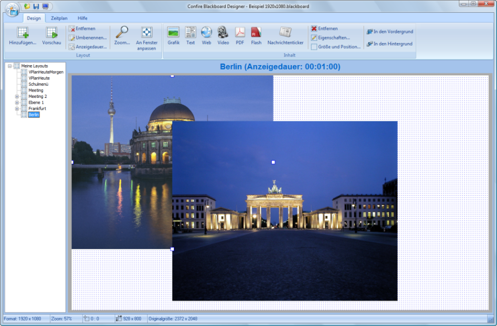

### Inhalte verschieben und deren Größe anpassen

Im Confire Blackboard Designer können Sie Ihre Inhalte beliebig innerhalb der Arbeitsfläche bzw. des Layouts positionieren und verschieben. Wenn Sie wollen, können Sie Inhalte auch übereinander legen. 

Entweder geben Sie mit Hilfe des Dialogs `Größe und Position` einen genauen Ort und einen genaue Größe für den eingefügten Inhalt an, oder sie benutzen einfach die Maus zum Verschieben und Vergrößern:

1.	Klicken Sie auf das Objekt, das Sie verschieben oder in seiner Größe verändern wollen. Sobald sie auf diese Weise ein Objekt ausgewählt haben, zeigt ein Positionsrahmen, wie Sie Ihn aus Microsoft Office kennen, das Sie das ausgewählte Objekt verändern können.

2.	Klicken Sie auf ein Objekt und bewegen Sie den Mauszeiger bei gedrückter linker Maustaste, um ein Objekt zu verschieben.

3.	Bewegen Sie den Mauszeiger über eines der kleinen weißen Quadrate des Positionsrahmens, so dass ein Doppelpfeil angezeigt wird. Wenn Sie jetzt die linke Maustaste gedrückt halten und den Mauszeiger bewegen, können Sie die Größe des Objekts frei verändern.

Wenn Sie für ein Bild eine exakte Breite und Höhe einstellen wollen, klicken Sie einfach auf das Bild und dann auf die Schaltfläche `Größe und Position` der Menügruppe `Inhalt` und geben die entsprechenden Zahlenwerte ein. 

Entfernen Sie dabei den Haken bei `Ansichtsverhältnis sperren`, können Sie Inhalte auch im Verhältnis zum ursprünglichen Seitenverhältnis verzerren. Umgekehrt können Sie mit Hilfe des Dialogs `Größe und Position` die Originalgröße oder das Original-Seitenverhältnis z. B. einer Grafik oder eines Videos wiederherstellen, indem Sie die Schaltflächen `Originalgröße einstellen` und `Originalverhältnis einstellen` nutzen.

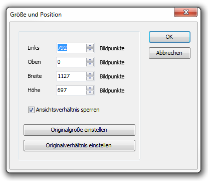

Wenn Sie mit Bildern, Videos und Flash-Animationen arbeiten, sollten Sie beachten, dass diese für ein bestimmtes Seitenverhältnis bzw. für eine bestimmte Breite und Höhe erstellt wurden. Bei HTML-Dokumenten ist dies in der Regel nicht der Fall, da diese auf allen Bildschirmen und deren unterschiedlichen Auflösungen angezeigt werden sollen. Auch bei PDF-Dokumenten fehlen ein exaktes Seitenverhältnis und einen exakte Originalgröße. Wenn Sie das Seitenverhältnis verändern, verzerren sich Bilder und Videos unschön. Bei Flash-Animationen kommt es zu keiner Verzerrung, Sie erhalten aber größere Ränder oder beschneiden die Darstellung. Sie sollten daher in der Regel das Seitenverhältnis beibehalten.

### Ausrichten von Objekten

Mit den Befehlen `In den Vordergrund` bzw. `In den Hintergrund`, die Sie über die rechte Maustaste oder im Menüband `Design > Inhalt` erreichen, können Sie ein Bild in den Vordergrund holen oder in den Hintergrund setzen.

Beim horizontalen und vertikalen Ausrichten von Inhalten hilft Ihnen das Ausrichtungsraster des Designers. Sie können Sie das Ausrichtungsraster des Designers verwenden, indem Sie die Funktion `Am Raster ausrichten` über `Blackboard-Button > Eigenschaften > Designer` aktivieren. In den Eingabefeldern Horizontales bzw. Vertikales Raster geben Sie die Rasterschritte als Bildpunkte vor. Wenn Sie den Haken an der Funktion `Am Raster ausrichten` setzen, werden alle Ihre Inhalte entsprechend der Vorgaben positioniert und ausgerichtet. Um das Raster zu sehen, setzen Sie einen Haken bei `Raster anzeigen`. 

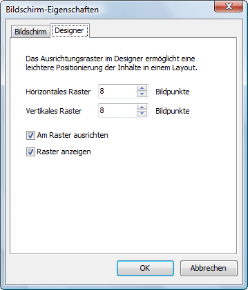

Das Raster wird durch die Punkte auf dem weißen Layout-Hintergrund sichtbar gemacht. Es erleichtert das exakte Ausrichten und Skalieren. 

> #### info::Hinweis
>
> Das Rasters ist - abhängig von der eingestellten Bildpunkteanzahl - nur bei ausreichender Größe des Anwendungsfensters des Confire Blackboard Designers sichtbar.

## Einen Nachrichtenticker einbinden
 
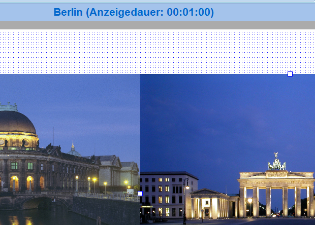

Über den Nachrichtenticker können Sie in eine Bildschirm-Präsentation aktuelle Infos einblenden, so wie Sie es von Nachrichtenkanälen im Fernsehen kennen. Der Clou: Sie können die News-Datei auch über eine Internet-Verbindung abrufen und so aktuelle Nachrichten in mehreren Schulgebäuden gleichzeitig anzeigen lassen. Oder Sie importieren einen RSS-Feed zum Beispiel von den Nachrichtenseiten der ARD.

Im Beispielprojekt verwendet das Layout „VPlanHeuteMorgen“ einen Nachrichtenticker aus einer lokalen News-Datei.

## Ein Wort zu Schriftarten

Die Schriftarten, die Sie im Designer verwenden, sollten auch auf dem Computer des Public Displays vorhanden sein. Andernfalls werden lediglich ähnliche Schriften dort verwendet, was ggf. zu anderen Zeilenumbrüchen führt. Die installierten Schriftarten hängen standardmäßig vom installierten Betriebssystem ab. So sind z.B. die Vista-Schriften Corbel, Candara, Colibri und Cambria standardmäßig nicht auf Windows-XP Computern installiert. Entweder verwenden Sie also sicherheitshalber nur die auch auf älteren Windows-Versionen vorhandenen Schriftarten „Arial“, „Arial Black“ und „Times New Roman“ oder Sie sorgen dafür, dass die verwendeten Schriften auch auf dem Computer des Public Displays installiert sind.

## So erstellen Sie ausgezeichnete Layouts

Wenn Sie wirklich ausgezeichnete Layouts erstellen wollen, sollten Sie folgende Regeln beachten:

1.	Erstellen Sie die Layouts immer für die Bildschirmgröße des Zielbildschirms. Ein Zielbildschirm mit einer anderen Bildschirmauflösung erfordert ein angepasstes Layout. 

2.	Behalten Sie immer das Original-Seitenverhältnis von Bildern und Videos bei.

3.	Sie können Bilder und Videos verkleinern, aber Sie sollten sie möglichst nicht über die Originalgröße hinaus vergrößern.

4.	Verwenden Sie nie mehr als zwei Schriftarten je Präsentation.

5.	Denken Sie daran, dass die Schriftarten, die Sie im Designer benutzen, auch auf dem Computer des Public Displays vorhanden sein sollten.

## Mit dem Zeitplan arbeiten
 
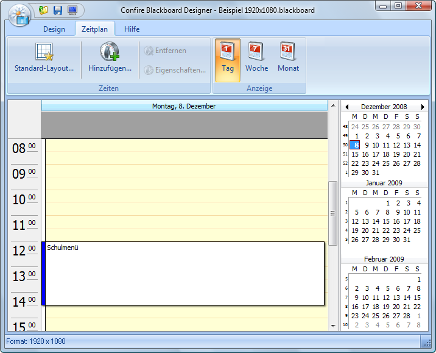

Wenn Sie bestimmte Layouts an einem bestimmten Tag, zu einer bestimmten Tageszeit oder in einem bestimmten Turnus, z. B. jeden Mittwoch um 17:30 Uhr, anzeigen möchten, können Sie den Zeitplan verwenden. Klicken sie dazu im Confire Blackboard Designer auf die Registerkarte für die Ansicht `Zeitplan`. Dort können Sie analog zu Microsoft Outlook Termine eintragen, zu denen bestimmte Layouts angezeigt werden sollen. Das Programmfenster der Ansicht `Zeitplan` besteht aus einem Hauptfenster, in dem Sie die Terminkarten für die eingetragenen Anzeigezeitpunkte in einer einstellbaren Kalender-Ansicht sehen. Rechts daneben befindet sich eine kleinere Kalender-Übersicht, in der Sie die Zeiträume markieren können, die im Hauptfenster angezeigt werden sollen. Am oberen Rand des Programmfensters befindet sich das Menüband mit den Menügruppen `Zeiten` und `Anzeige`. Mit den Schaltflächen in der Menügruppe `Zeiten` können Sie Termine anlegen, löschen und bearbeiten, in der Menügruppe `Anzeige` finden Sie die Einstellungen für die Anzeige der Kalenderansicht.

### Standardlayout festlegen

Wenn Sie mit dem Zeitplan arbeiten, sollten Sie ein Standard-Layout bestimmen, das immer angezeigt wird, wenn kein sonstiger Anzeigetermin eingetragen wurde. So verhindern Sie einerseits, dass durch einen Irrtum ein leerer Bildschirm angezeigt wird. Andererseits brauchen Sie so für das regelmäßig angezeigte Layout nicht gesondert Termine festzulegen. Sie tragen stattdessen nur die Ausnahmen in den Zeitplan ein.

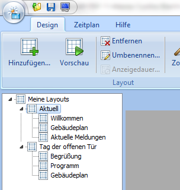

Um ein Standard-Layout festzulegen, gehen Sie bitte wie folgt vor:

1.	Klicken Sie im Menu `Zeitplan` auf die Schaltfläche `Standard-Layout`.

2.	Klicken sie auf die kleine Lupe rechts neben der Anzeige `Layout`.

3.	Im sich öffnenden Dialog `Layout auswählen` markieren Sie das gewünschte Layout in Ihrem Projektbaum und bestätigen Sie mit `OK`.

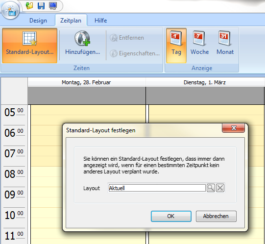

### Einen Anzeige-Termin hinzufügen

Klicken Sie im Menu `Zeitplan` auf `Hinzufügen`, um einen neuen Anzeigetermin hinzuzufügen. Anschließend tragen Sie die gewünschten Werte für Start- und Endzeitpunkt ein und bestimmen, welches Layout angezeigt werden soll. Alternativ können Sie auch mit gedrückter linker Maustaste einen Zeitraum in der zentralen Kalender-Ansicht markieren und dann mit `Rechte Maustaste > Hinzufügen` einen Termin für den ausgewählten Zeitraum eintragen. Zusätzlich können Sie noch eine Bemerkung eintragen, die dann in der Kalenderansicht mit angezeigt wird. Anschließend bestätigen Sie mit `OK`.

> #### info::Hinweis
>
> Wenn sie in der kleinen Kalender-Übersicht rechts neben der zentralen Kalender-Ansicht auf einen Zeitraum mit der Maus markieren, ändert sich die Anzeige des Zeitraums, den die zentrale Ansicht insgesamt darstellt, analog.

### Eine Terminserie eintragen

Wenn Sie im Programmdialog `Eigenschaften` oder `Neue Anzeigezeit` eines Anzeige-Termins auf die Schaltfläche `Terminserie` klicken, können Sie zusätzlich zum Start- und Endzeitpunkt des Termins festlegen, nach welchem Muster und bis zu welchem Datum bzw. wie viele Male sich der Termin wiederholen soll. Ein Beispiel wäre die Festlegung: Layout „Mittagsmenü“, von 12 Uhr bis 15 Uhr, tägliche Wiederholung, jeden Arbeitstag, bis Ende Mai.

Nachdem Sie diese Festlegung für Ihre Terminserie getroffen haben und anschließend mit `OK` bestätigt haben, wird in der Kalender-Ansicht für jeden Anzeige-Termin der Serie eine eigene Terminkarte angezeigt. Als Hinweis, dass es sich nicht um eine Anzahl von Einzelterminen handelt, sondern um eine Serie, wird links oben auf der Terminkarte ein Pfeilzyklus angezeigt. Zusätzlich empfiehlt es sich, Ihre Terminserien mit einem aussagekräftigen Eintrag im Feld `Bemerkungen` zu versehen.

### Die Anzeigezeit eines Termins oder einer Terminserie ändern

Wie in Microsoft Outlook können Sie die Anzeigezeit eines einzelnen Termins auch per Drag & Drop mit der Maus nachträglich verändern. Neben dem Verschieben des Termins auf einen anderen Zeitpunkt können Sie ihn auch durch das Ziehen an den Rändern der entsprechenden Terminkarte verlängern oder verkürzen und zwar auch über mehrere Tage. Geht ein Termin über mehrere Tage, ändert sich die Anzeige der Terminkarte zu einem mehrere Tage überspannenden Balken am oberen Rand in dem jeweils ein Uhrsymbol den genauen Start- und Endzeitpunkt anzeigt.

Alternativ können Sie die Anzeigezeit eines Termins auch mit Hilfe des Programmdialogs `Eigenschaften der Anzeigezeit` verändern, indem Sie einen Termin markieren und die Schaltfläche `Eigenschaften` im oberen Menüband betätigen oder mit der rechten Maustaste auf eine Terminkarte klicken und im Kontextmenü `Eigenschaften` auswählen.

Wenn Sie per Drag & Drop die Anzeigezeit eines Termins ändern, der Mitglied einer Terminserie ist, bleibt der Termin zwar weiterhin ein Element der ursprünglichen Terminserie. Allerdings erscheint der Pfeilzyklus, der die Zugehörigkeit zur Terminserie anzeigt, jetzt durchgestrichen, so dass man erkennt, dass dieser Termin nicht mehr der Anzeigezeit der ursprünglichen Serie entspricht. Es ändert sich auch nur die Anzeigezeit des einzelnen Termins, die anderen Termine der Serie bleiben von dieser Änderung unberührt.

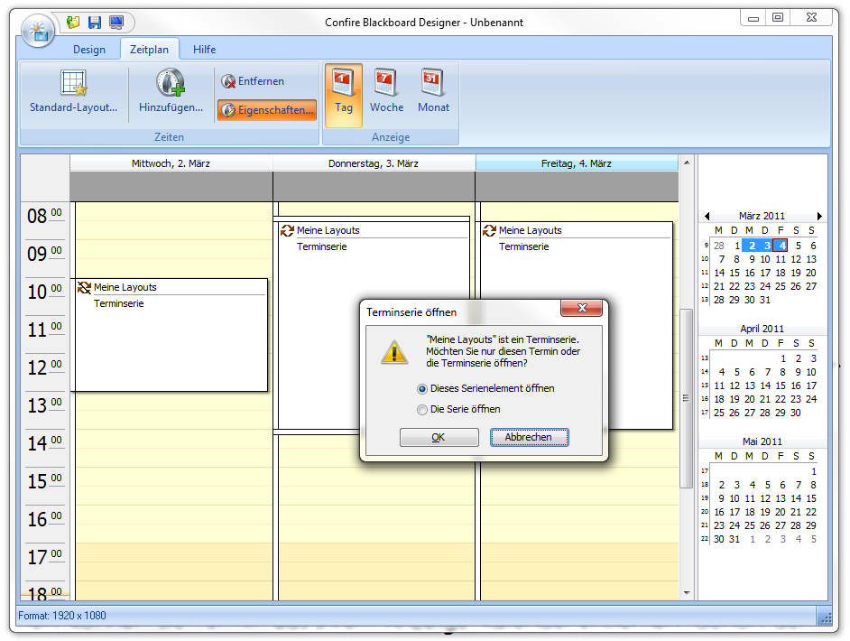
 
### Einen Termin oder eine Terminserie entfernen

Wenn Sie einen Termin markieren und anschließend die Schaltfläche `Entfernen` im oberen Menüband oder im Kontextmenü der Terminkarte auswählen, können Sie Termin aus Ihrem Anzeige-Kalender entfernen. Gehört der markierten Termin zu einer Terminserie, werden Sie vor dem Löschen gefragt, ob Sie nur den einzelnen Termin oder die gesamte Serie löschen wollen.

