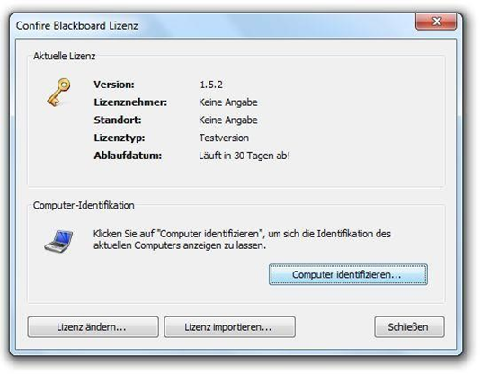

# Installation

## Die Installationspakete herunterladen

Die Confire Blackboard Software besteht aus zwei Modulen, dem Confire Blackboard Designer, mit dem Sie Präsentationen erstellen und dem Confire Blackboard Player, der diese Präsentationen für Ihr Publikum anzeigt. 

Zur Installation beider Module steht jeweils eine eigene Installationsdatei bereit:

* `ConfireBlackboardDesignerSetup.exe` 
* `ConfireBlackboardPlayerSetup.exe`

Beide können unter [folgendem Link] über unsere Webseite herunterladen können. 

## Vor der Installation

Der typischen Nutzung entspricht die Installation des Confire Blackboard Players auf dem Computer, der für die Anzeige der Präsentationen zuständig ist - in der Regel ist dies der Rechner, der auf der Rückseite des Displays montiert ist. Der Designer wird üblicherweise auf dem Computer installiert, auf dem die Präsentationen erstellt und zur Anzeige weiterverteilt werden. Beide Module können auch problemlos auf demselben Rechner installiert werden, etwa zu Testzwecken.

## Unterschiede der lizenzierten Version und der Testversion

Der Confire Blackboard Designer kann ohne Einschränkung auf beliebig vielen Computern installiert und in vollem Umfang genutzt werden. Er muss nicht lizenziert werden. Der Confire Blackboard Player wird dagegen standardmäßig als 30-TageTestlizenz installiert. D. h. Sie können die Confire Blackboard Software 30 Tage lang in vollem Umfang testen und in diesem Zeitraum auch den kostenfreien Support in Anspruch nehmen, ohne Lizenzdaten anfordern zu müssen. Zur dauerhaften und uneingeschränkten Nutzung des Confire Blackboard Players müssen Sie eine Lizenz bei STÜBER SYSTEMS erwerben. Die Volllizenz umfasst eine Subskription für drei Jahre. Während des Subskriptionszeitraums erhalten Sie kostenfrei Support sowie alle Upgrades und Serviceupdates, die innerhalb dieses Zeitraums erscheinen. Nach Ablauf bleibt die Lizenz erhalten und kann weiter genutzt werden, oder Sie erwerben eine erweiterte Subskription.

## Die Installation starten

Die Installation wird durch einen Doppelklick auf die jeweilige Installationsdatei gestartet. Anschließend führt Sie der Installationsassistent durch den Installationsvorgang. Sie können im Zuge der Installation selbst ein Programmverzeichnis angeben, in das die Programmdateien kopiert werden sollen, oder Sie behalten einfach die Vorgabe des Installationsassistenten bei und klicken auf `Installieren`. Möglicherweise müssen Sie zusätzlich noch die Installation durch Eingabe Ihres Windows Administratorpasswortes oder durch einen Klick auf `Ok` im Rahmen der Windows Benutzerkontensteuerung bestätigen. Durch einen Klick auf `Fertigstellen` schließen Sie die Installation ab

## Die Confire Blackboard Software starten

Nach Abschluss der Installation können Sie den Confire Blackboard Designer und den Confire Blackboard Player durch einen Klick auf die entsprechende Programmverknüpfung unter `Start > STÜBER SYSTEMS` im Windows Startmenü starten. Hier finden Sie auch die Verknüpfung zum Zugriff auf das Confire Blackboard Benutzerhandbuch, in dem Sie alle nötigen Informationen zur Benutzung der Software finden. Beim ersten Start des Confire Blackboard Players empfängt Sie ein Willkommensbildschirm, der Ihnen die Auswahl zwischen der Nutzung mit einer 30-Tage-Testlizenz oder der dauerhaften Freischaltung mit einer Volllizenz ermöglicht.

## Den Confire Blackboard Player mit einer Testlizenz ausprobieren

Sofern Sie noch über keine Volllizenz verfügen, können Sie den Confire Blackboard Player mit einer 30-Tage-Testlizenz ausprobieren. Klicken Sie dazu auf dem Willkommensbildschirm, der beim ersten Start des Players erscheint, auf `Weiter` und wählen Sie anschließend den Punkt `Als Testlizenz starten`. Nach einem Klick auf `Starten` gelangen Sie zum Startbildschirm der Testlizenz, der Sie über den verbleibenden Testzeitraum informiert. Ein erneuter Klick auf `Weiter` startet den Player mit der gewählten Testlizenz. Nach Ablauf des dreißigtägigen Testzeitraumes gelangen Sie beim Start des Confire Blackboard Players zurück zum Willkommensbildschirm, der Ihnen das dauerhafte Freischalten durch das Eintragen der Daten Ihrer Volllizenz ermöglicht.

## Ihre Lizenz anfordern

Die Lizenzen zur dauerhaften Nutzung des Confire Blackboard Players werden rechnergebunden erstellt, das heißt, sie berechtigen zur Nutzung der Software in Kombination mit einem bestimmten Rechner. Damit die Lizenz einem bestimmten Rechner exakt zugeordnet werden kann, ermittelt der Confire Blackboard Player einen eindeutigen Computer-Schlüssel, den Sie uns bitte bei der Anforderung einer Lizenz unter "license@stueber.de" mit übermitteln.

Um den Computer-Schlüssel zur Identifikation des Rechners, auf dem der Confire Blackboard Player dauerhaft installiert werden soll zu erstellen, wählen Sie beim ersten Start des Players im Willkommensassistenten den Punkt `Den aktuellen Computer identifizieren`. Nach dem Ablauf einer Testlizenz werden Sie automatisch auf diesen Bildschirm geleitet. 

Auch während Sie den Player mit einer Testlizenz nutzen, haben Sie jederzeit die Möglichkeit einen Computer-Schlüssel zu erstellen, indem Sie auf dem Menüreiter `Hilfe` die Schaltfläche `Lizenzierung` anklicken.

Klicken Sie anschließend auf „Computer identifizieren“.

In beiden Fällen öffnet sich ein Dialogfenster, das den Computer-Schlüssel als Zeichenfolge anzeigt. Sie können diesen über `Rechtsklick > Kopieren` in die Zwischenablage kopieren oder Sie nutzen dazu die Schaltfläche rechts neben dem angezeigten Schlüssel `Schlüssel in die Zwischenablage kopieren`. Anschließend fügen Sie den Schlüssel in Ihre Email an "license@stueber.de" zur Anforderung einer Lizenz ein.

## Ihre Lizenzdaten von Hand eintragen

Kurze Zeit nach Versand Ihrer Lizenzanfrage erhalten Sie von uns eine Antwort-Email mit Ihren Lizenzdaten. Die Lizenzdaten können Sie nun per Hand eintippen oder als Datei importieren.

Ist der Confire Blackboard Player noch nicht lizenziert oder ist Ihre Testlizenz abgelaufen, wählen Sie zum Eintragen Ihrer Lizenzdaten im Willkommensassistenten bitte den Punkt `Meine Lizenzdaten eingeben`. Es öffnet sich ein Fenster, in dem Sie Ihre Lizenzdaten direkt eintragen oder diese aus der Zwischenablage einfügen können - oder Sie wählen die Möglichkeit `Lizenz importieren`, die im folgenden Abschnitt beschrieben ist.

Wenn Sie den Confire Blackboard Player mit einer laufenden Testlizenz nutzen, gehen Sie bitte folgendermaßen vor, um Ihre Lizenzdaten von Hand einzugeben:

1. Starten Sie den Confire Blackboard Player.

2. Blättern Sie zum Menüregister `Hilfe` und drücken Sie die Schaltfläche `Lizenzierung`.

3. Klicken Sie auf die Schaltfläche `Lizenz ändern` und fügen Sie Namen und Standort des Lizenznehmers sowie den Lizenzschlüssel aus unserer Email in die vorgesehenen Felder des Dialogfensters `Lizenz ändern` ein.

4. Bestätigen Sie Ihre Angaben abschließend mit `Ok`.

Die eingegebenen Lizenzdaten sehen Sie nun im Dialogfenster `Confire Blackboard Lizenz`. Schließen Sie dieses Dialogfenster, um die soeben lizenzierte Version des Players zu nutzen.

## Eine Lizenzdatei importieren

Im Anhang unserer Lizenz-Email befindet sich die Datei `Blackboard.Player.lic`. Sie können die Lizenzdaten statt sie von Hand einzugeben auch aus dieser Datei importieren, was Ihnen die Schreibarbeit erspart. Gehen Sie dazu bitte folgendermaßen vor:

1. Speichern Sie die Lic-Datei, die sich im Anhang unserer Lizenz-Email befindet, in einem Zielverzeichnis.

2. Starten Sie den Confire Blackboard Player.

3. Blättern Sie zum Menüregister `Hilfe` und drücken Sie die Schaltfläche `Lizenzierung`.

4. Klicken Sie auf die Schaltfläche `Lizenz importieren` und stellen Sie im erscheinenden Explorerfenster das Zielverzeichnis Ihrer Lizenzdatei ein.

5. Markieren Sie die Datei `Blackboard.Player.lic` und bestätigen Sie Ihre Auswahl mit `Öffnen`.

Nach dem Schließen des Dialogfensters `Confire Blackboard Lizenz` können Sie die frisch lizenzierte Version einsetzen.

[folgendem Link]: http://showtime.stueber.de/download-archive.php