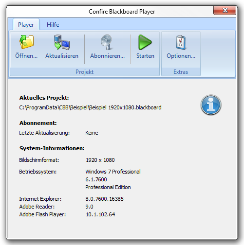
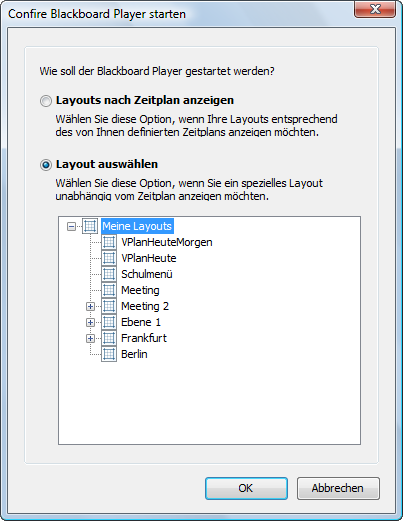

# Der Player

## Programmstart

Der Confire Blackboard Player wird auf dem Computer des Zielbildschirms (Public Display bzw. digitales Schwarzes Brett) installiert. Er zeigt die mit dem Confire Blackboard Designer erstellte Präsentation an. Sie können den Player über den entsprechenden Eintrag im Windows-Startmenü starten. Klicken Sie dazu auf `Start > STÜBER SYSTEMS > Confire Blackboard Player`.
 

## Das Programmfenster des Confire Blackboard Players

Das Programmfenster des Confire Blackboard Players besteht aus dem Menüband, das die Bedienfunktionen im oberen Bereich zugänglich macht, und der Anzeige der System-Informationen im unteren Fensterbereich. Im Bereich der Systeminformationen sehen Sie, welches Projekt aktuell geladen ist und wann der Player zuletzt ein abonniertes Projekt neu abgerufen hat. Zusätzlich wird angezeigt, welches Bildschirmformat das Display hat und mit welchem Betriebssystem der Computer arbeitet. Zusätzlich erhalten Sie Versionsangaben zum Internet Explorer (den benötigen Sie, um Web-Inhalte anzuzeigen und zum Adobe Flash Player (den benötigen Sie, um Flash-Animationen abzuspielen). 

## Präsentation manuell öffnen und starten

Mit der Schaltfläche `Öffnen` öffnen Sie eine Präsentation. Anschließend können Sie mit der Schaltfläche `Start` eine Präsentation bzw. eine Layout-Sequenz angeben, mit der die Präsentation gestartet wird.

Sie können dabei wählen, ob die Präsentation nach Zeitplan („Layouts nach Zeitplan“) oder als Sequenz („Layout auswählen“) angezeigt werden soll. 

Wählen Sie die Möglichkeit `Layout nach Zeitplan anzeigen` zeigt der Player im Anschluss genau die Inhalte an, für die Sie zuvor mit Hilfe der Funktion `Zeitplan` im Designer Anzeigetermine festgelegt haben. Die Bedienung des Zeitplanes ist im Abschnitt `Mit dem Zeitplan arbeiten` erklärt.

Wählen Sie die Möglichkeit `Layout auswählen`, werden alle Layouts, die im Projektbaum unterhalb des von Ihnen im Programmdialog markierten Layouts bzw. Unterlayouts liegen, entsprechend der im Designer eingetragenen Anzeigedauer als Sequenz abgespielt. Wie Sie aufeinanderfolgende Präsentationsbildschirme in Sequenzen organisieren erfahren Sie im Abschnitt `Layouts in Sequenzen organisieren`.

## Präsentation per Autostart öffnen und starten

Sie haben die Möglichkeit festzulegen, dass der Player beim Start Ihres Rechners automatisch mit einer bestimmten Projektdatei geöffnet wird. Um diese Einstellung vorzunehmen, führen Sie bitte die folgenden Schritte aus: 

1. Erstellen Sie eine Verknüpfung zur Anwendungsdatei `ConfireBlackboard.exe`

2. Klicken Sie mit der rechten Maustaste auf die Verknüpfung und wählen Sie den Aufruf `Eigenschaften` aus dem Kontextmenü.

3. Öffnen Sie im erscheinenden Dialogfenster die Registerkarte `Verknüpfung`.

4. Fügen Sie im Eingabefeld `Ziel` dem Programmpfad, z. B. `C:\Program Files\Stueber Software\Confire Blackboard\ConfireBlackboardPlayer.exe`, einen der folgenden beiden Parameter hinzu.
   
   * Ergänzen Sie `[Leerzeichen]-autoplay`, wenn Sie möchten, dass Ihre Projektdatei mit der Option `Layout auswählen` beginnend mit dem ersten Layout angezeigt wird.
   
   * Ergänzen Sie `[Leerzeichen]-autoplay[Leerzeichen]/s`, wenn Sie möchten, dass Ihre Projektdatei mit der Option `Layouts nach Zeitplan anzeigen` gestartet wird.  

5.	Bestätigen Sie Ihre Angaben mit `Übernehmen` und `OK`. 

6.	Erstellen Sie eine Kopie der Verknüpfung und legen Sie diese im Autostart-Ordner Ihres Windows-Rechners ab.

Wenn Sie den Rechner das nächste Mal starten, wird der Player automatisch mit der Blackboard-Datei geöffnet, die  Sie in den Startoptionen des Players hinterlegt haben.
