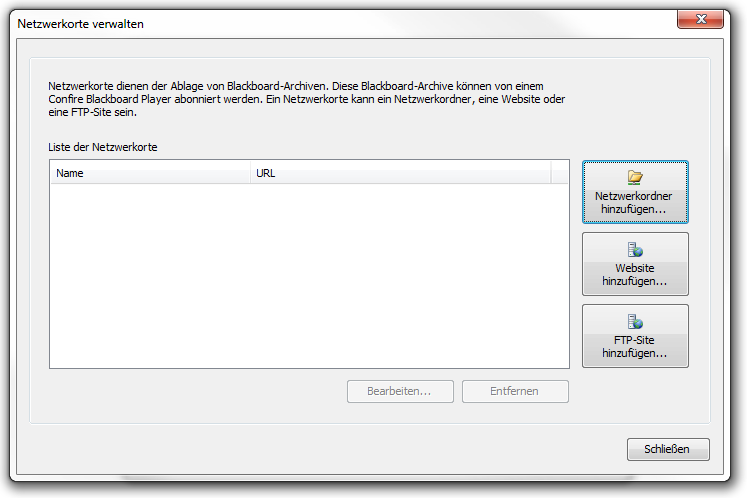
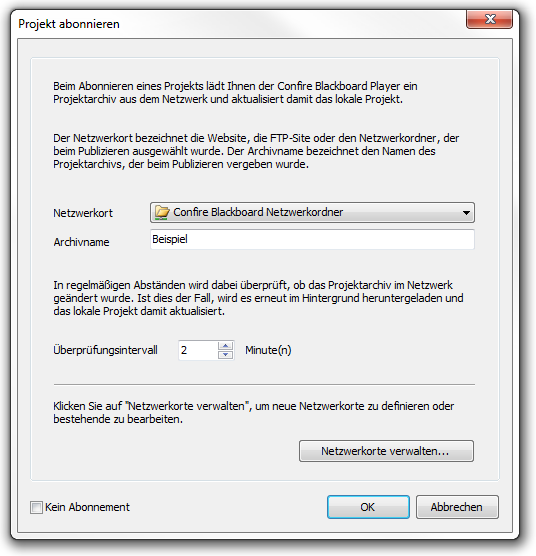

# Projekte veröffentlichen und abonnieren

## Das Zusammenspiel von Designer und Player beim Veröffentlichen und Abonnieren

Im Normalfall wird eine Blackboard-Präsentation auf einem Rechner erstellt und auf einem anderen Rechner abgespielt. Nutzen Sie gegenwärtig den Confire Blackboard Designer und den Player im Rahmen einer Testlizenz auf demselben Rechner, ist dieser Vorgang vielleicht noch nicht von Bedeutung für Sie. Im Alltagseinsatz von Confire-Blackboard stellt sich dagegen die Frage, wie man eine Präsentation, die z. B. auf dem Laptop erstellt wurde, möglichst schnell und einfach an den Zielrechner, der die Darstellung auf dem Public Display steuert, übertragen kann.

Im Unterkapitel „Dem Layout Inhalte hinzufügen“ haben Sie bereits die Möglichkeit kennengelernt, Inhaltsdateien in das Projekt einzubetten. Projekte mit eingebetteten Inhaltsdateien können Sie auf einen anderen Rechner übertragen, indem Sie die Blackboard-Datei sowie den zugehörigen Projekt-Ordner auf den Zielrechner kopieren. Sie können natürlich die beiden Komponenten ebenso gut in einem Netzwerkverzeichnis speichern, auf das sowohl der Rechner, mit dem die Präsentation bearbeitet wird, als auch der Rechner, der die Bildschirmpräsentation steuert, Zugriff haben. Dieses manuellen Kopieren kann in lokalen Netzwerken praktikabel sein, stößt jedoch an seine Grenzen, wo Projekte z. B. von unterwegs, ohne Zugriff auf das lokale Netzwerk oder auch als Dienstleistung übertragen werden sollen. Zur Vereinfachung dieser Übertragung steht die Funktion „Veröffentlichen“ im Confire Blackboard Designer zur Verfügung. Diese funktioniert so, dass ein Speicherort in einem Netzwerkordner, einem FTP- oder Webserver festgelegt wird, an dem ein Projektarchiv mit Informationen zur Aktualisierung der enthaltenen Präsentationen abgelegt wird. 

Als Gegenstück zur Funktion „Veröffentlichen“ im Confire Blackboard Designer kann der Confire Blackboard Player diese Projektarchive dann „abonnieren“. Das bedeutet, dass der Player, sobald er ein Projektarchiv abonniert hat, in regelmäßigen Abständen die Informationen zur Aktualität des Projektarchives von Speicherort abruft. Sind die enthaltenen Präsentationen oder Zeitpläne vom Designer aus aktualisiert worden, lädt der Player das Projektarchiv neu, um anschließend die aktualisierten Inhalte anzuzeigen. Genauso wie ein Netzwerk-Ort - z. B. ein Netzwerkordner - von mehreren Playern (bzw. Designern) gleichzeitig genutzt werden kann, kann auch ein veröffentlichtes Projektarchiv von mehreren Playern gleichzeitig abonniert werden. Im täglichen Dauerbetrieb funktioniert das Zusammenspiel so, dass die Player ein Projektarchiv von einem Netzwerkort abonnieren und der Designer genutzt wird, um die darin hinterlegten Präsentationen, Inhalte und Zeitpläne je nach Wunsch zu bearbeiten und zu erneuern. Als Voraussetzung des Veröffentlichens und Abonnierens muss jedoch zunächst ein solcher Netzwerkort festgelegt werden. Wie sie einen solchen Netzwerkort anlegen und verwalten können, erfahren Sie im nächsten Abschnitt.

Oft werden Netzwerkorte oder veröffentlichte Projekte nach den lokalen Gegebenheiten und Anzeige-Aufgaben benannt: „Hauptgebäude“, „Eingangsbereich“, „Herrenabteilung“ bzw. „Aktuell“, „Sonderaktion“ usw. Dies kann die Orientierung bei mehreren Displays bzw. digitalen Schwarzen Brettern erleichtern. Zwei separate Projekte sind prinzipiell allerdings nur nötig, wenn zwei unterschiedliche Bildschirmauflösungen bedient werden sollten oder zwei Displays zum gleichen Zeitpunkt etwas Anderes darstellen sollen. Legen Sie die Bereiche „Hauptgebäude“, „Eingangsbereich“ oder „Sonderaktion“ innerhalb eines einzelnen Projektes im Projektbaum als logische Unterteilung an und nutzen das Wissen aus den Abschnitten „Inhalte in verschiedenen Ebenen organisieren“ und „Layouts in Sequenzen organisieren“, kann das Ihre Arbeit möglicherweise erleichtern.

## Netzwerkorte verwalten

Wird im Confire Blackboard Designer die Funktion „Veröffentlichen“ über die Confire-Blackboard-Hauptschaltfläche oben links, „Blackboard-Button|Veröffentlichen“ aufgerufen, öffnet sich der Programmdialog „Projekt veröffentlichen“, der Sie durch alle Schritte zum Anlegen eines Projektarchivs führt. Der erste Bildschirm des Dialogs fordert Sie dazu auf, einen Netzwerkort anzugeben, an dem das komprimierte Projektarchiv gespeichert werden kann. Naheliegender Weise muss dieser Speicherort sowohl vom Arbeitsplatz, an dem der Designer genutzt wird, als auch vom PC, der den Player ausführt, erreichbar sein. Es kann sich dabei um einen Netzwerkordner handeln, für den zuvor die entsprechenden Zugriffsberechtigungen im lokalen PC-Netzwerk festgelegt worden sind oder um einen passwortgeschützten Ordner auf einem FTP-Server oder auch um eine WebDAV-Freigabe auf einem Webserver.

Sofern Sie die Funktion des „Veröffentlichens“ zum ersten Mal nutzen, ist noch kein Netzwerkort zum Veröffentlichen eingetragen, so dass Sie zunächst die Schaltfläche „Netzwerkorte verwalten“ betätigen müssen, um mindestens einen Netzwerkort einzutragen.

Der gleiche Dialog empfängt Sie auch, wenn Sie im Confire Blackboard Player auf den Menüpunkt „Abonnieren“ klicken und anschließend auf „Netzwerkorte Verwalten, z. B. weil der gewünschte Netzwerkort noch nicht in der Liste der zum Abonnieren verfügbaren Netzwerkorte eingetragen ist.
 

### Einen Netzwerkordner hinzufügen

Um einen Netzwerkordner als Speicherort für veröffentlichte Projektarchive hinzuzufügen, gehen Sie wie folgt vor:

1. Klicken Sie auf die Schaltfläche `Netzwerkordner hinzufügen` und tragen Sie im sich öffnenden Dialog für das Feld `Name` den Namen ein, unter dem Ihr Netzwerkordner später im Programm angezeigt werden soll, z. B. „Confire Blackboard Netzwerkordner“.

2.	In das Feld `Pfad` tragen Sie anschließend den Pfad zum zuvor für die Player und Designer freigegebenen Netzwerkordner ein, oder Sie klicken auf die Schaltfläche `Durchsuchen`, um Ihre Auswahl mit der Maus zu treffen.

3.	Klicken sie optional auf die Schaltfläche `Netzwerkordner überprüfen`, um zu testen, ob der eingetragenen Netzwerkordner tatsächlich von dem Computer, mit dem Sie arbeiten, erreichbar ist.

4.	Bestätigen Sie mit `OK`.

Der neu eingetragene Netzwerkordner ist jetzt in der Liste der Netzwerkorte aufgeführt und kann mit Hilfe der Schaltflächen `Bearbeiten` und `Entfernen` bearbeitet oder wieder entfernt werden.

### Eine Webseite hinzufügen

Um eine WebDAV-Freigabe zu den Netzwerkorten zum Veröffentlichen Ihrer Projektarchive hinzuzufügen, führen Sie bitte folgende Schritte aus:

1.	Klicken Sie auf die Schaltfläche `Webseite hinzufügen` und tragen Sie im sich öffnenden Dialog für das Feld `Name` den Namen ein, unter dem Ihr Netzwerkordner später im Programm angezeigt werden soll, z. B. „Confire Blackboard Web-Freigabe“.

2.	In das Feld `URL` tragen Sie anschließend die Internet-Adresse Ihrer WebDAV-Freigabe ein. Außerdem müssen Sie im Feld `Benutzername` und `Kennwort` die bei der Einrichtung Ihrer Web-Freigabe festgelegten Anmeldedaten eintragen.

3.	Klicken sie optional auf die Schaltfläche `Webseite überprüfen`, um zu testen, ob die eingetragene Web-Freigabe tatsächlich von dem Computer, mit dem Sie arbeiten, erreichbar ist.

4.	Bestätigen Sie mit `OK`.

Die neu eingetragene Web-Freigabe ist jetzt in der Liste der Netzwerkorte aufgeführt und kann mit Hilfe der Schaltflächen `Bearbeiten` und `Entfernen` bearbeitet oder wieder entfernt werden.

### Einen FTP-Server hinzufügen

Um einen Ordner auf einem FTP-Server zu den Netzwerkorten zum Veröffentlichen Ihrer Projektarchive hinzuzufügen, gehen Sie bitte folgendermaßen vor:

1.	Klicken Sie auf die Schaltfläche `FTP-Site hinzufügen` und tragen Sie im sich öffnenden Dialog für das Feld `Name` den Namen ein, unter dem Ihr Netzwerkordner später im Programm angezeigt werden soll, z. B. „Confire Blackboard FTP-Site“.

2.	In das Feld `URL` tragen Sie anschließend die Internet-Adresse Ihres FTP-Servers und des vorgesehenen Ordners ein. Zusätzlich können im Feld `Benutzername` und `Kennwort` die bei der Einrichtung des FTP-Servers festgelegten Anmeldedaten eintragen werden.

3.	Klicken sie optional auf die Schaltfläche `FTP-Site überprüfen`, um zu testen, ob auf die eingetragene FTP-Site problemlos zugegriffen werden kann.

4.	Bestätigen Sie mit `OK`.

Die neu eingetragene FTP-Site ist jetzt in der Liste der Netzwerkorte aufgeführt und kann mit Hilfe der Schaltflächen `Bearbeiten` und `Entfernen` bearbeitet oder wieder entfernt werden.

## Einen Netzwerkort zum Veröffentlichen auswählen und einen Archivnamen eintragen

Sofern Sie, wie im vorherigen Abschnitt erklärt, bereits Netzwerkorte zum Veröffentlichen Ihrer Projekte angelegt haben, können Sie zum „Veröffentlichen“ Ihres aktuellen Projektes im Designer einen Netzwerkort aus der Liste „Netzwerkorte“ auswählen. Sie rufen die Funktion "Veröffentlichen“ über den Menüpunkt `Blackboard-Button > Veröffentlichen` auf. Mit der Schaltfläche `Netzwerkorte verwalten` können Sie den Dialog zum Anlegen, Löschen und Überprüfen Ihrer Netzwerkorte aufrufen, der im vorhergehenden Abschnitt beschrieben ist. Sobald Sie einen Netzwerkort, an dem Ihr Projekt veröffentlicht werden soll, aus der Liste ausgewählt haben, können Sie auf „Weiter“ klicken und werden zum Eintragen eines Namens für Ihr Projektarchiv aufgefordert. Dieser Name kann beim ersten Anlegen eines Projektarchives frei gewählt werden und muss nicht mit dem Namen übereinstimmen, unter dem Sie Ihr Projekt lokal gespeichert haben. 

Der Name des Projektarchivs sollte klar sein und leicht zu merken. Veröffentlichen Sie zum ersten Mal ein Projekt, so müssen Sie den gewählten Namen, z. B. „aktuell“, anschließend zusammen mit dem Netzwerkort beim Abonnieren durch die Player richtig eintragen, damit diese Player künftig alle Aktualisierungen des Projektarchivs „aktuell“ verfolgen. Haben umgekehrt Ihre Player schon ein Projekt, z. B. mit dem Namen „Hauptgebäude“, abonniert, müssen Sie bei jedem Veröffentlichen mit dem Designer diesen Namen richtig angeben, damit Ihre Veränderungen auch die richtigen Bildschirme (z. B. im Hauptgebäude) erreichen.

## Die Funktion „Veröffentlichen“ im Confire Blackboard Designer

Wenn Sie Ihr Projekt mit Hilfe der Funktion „Veröffentlichen“ (das grundsätzliche Prinzip wird im vorhergehenden Abschnitt „Das Zusammenspiel von Designer und Player beim Veröffentlichen und Abonnieren“ erklärt) mit dem Designer veröffentlichen wollen, gehen Sie bitte wie folgt vor:

1.	Klicken Sie auf `Blackboard-Button > Veröffentlichen`.

2.	Wählen Sie unter `Netzwerkort` ein Ziel aus (Wie Sie die in der Liste enthaltenen Netzwerkorte verwalten, wird im vorhergehenden Abschnitt `Netzwerkorte verwalten` erklärt) und bestätigen Sie mit „Weiter“.

3.	Geben Sie einen Namen für das Projektarchiv an, der dem Namen des durch die Player abonnierten Projekts entspricht und bestätigen Sie mit `Weiter`.

4.	Ihnen wird eine Erfolgsmeldung über die erfolgte Veröffentlichung angezeigt.

Ihr lokales Projekt ist jetzt am angegebenen Netzwerkort als Projektarchiv hinterlegt und kann von dort durch die Player abgerufen werden. Das Gegenstück zum Veröffentlichen mit dem Designer ist die Funktion „Abonnieren“ im Confire Blackboard Player. Die Bedienung dieser Funktion wird in den folgenden Abschnitten erklärt.

> #### info::Bemerkung
>
> Je umfangreicher die Dateigröße der eingebetteten Inhaltsdateien ist, desto länger dauert das Erstellen und Abspeichern eines Projektarchivs. Prüfen Sie deshalb die Möglichkeit gemischte Projekte anzulegen, die sowohl eingebettete als auch externe Inhaltsdateien enthalten. Dies bietet sich z.B. an, wenn Ihr Projekt einzelne sehr umfangreiche Inhaltsdateien, z.B. ein Firmenvideo enthält. Legen Sie  in diesem Fall, sofern die Möglichkeit besteht, das speicherintensive Firmenvideo als externe Datei in einem Netzwerkverzeichnis ab. Auf diese Weise verhindern Sie, dass einzelne Dateien den Prozess des Veröffentlichens unnötig in die Länge ziehen. 

## Die Funktion „Abonnieren“ im Confire Blackboard Player

Wenn Sie im Designer über die Funktion „Veröffentlichen“ ein Projektarchiv erstellt und an einem Netzwerkort gespeichert haben, können Sie dieses Archiv im Player abonnieren. Diese Funktion sorgt dafür, dass ein abonniertes Projektarchiv nach jeder Überarbeitung automatisch entpackt und die Darstellung im Player aktualisiert wird (das grundsätzliche Prinzip wird im vorhergehenden Abschnitt „Das Zusammenspiel von Designer und Player beim Veröffentlichen und Abonnieren“ erklärt).
 

 
Um ein Projektarchiv mit einem Player zu abonnieren, führen Sie bitte folgende Schritte aus:

1. Klicken Sie im Menüband des Players auf die Schaltfläche `Abonnieren`

2. Deaktivieren Sie ggf. die Option `Kein Abonnement` unten rechts, um das Abonnieren freizuschalten.

3. Wählen Sie aus der Liste `Netzwerkorte` einen Ort, von dem Sie abonnieren wollen. (Wie sie mit Hilfe der Funktion „Netzwerkorte verwalten“ Änderungen an den in der Liste enthaltenen Netzwerkorten vornehmen können, erfahren Sie im vorhergehenden Abschnitt.)

4. Tragen Sie im Feld `Archivname` den Namen des Archivs ein, das sie abonnieren wollen.

5. Legen Sie im Feld `Überprüfungsintervall` fest, wie häufig der Player den Netzwerkort auf Aktualisierungen überprüfen soll.

6. Bestätigen Sie mit `OK`

7. Haben Sie ein neues Archiv abonniert, öffnet sich der Dialog `Projekt speichern unter`. Geben Sie hier bitte einen lokalen Speicherort an und bestätigen Sie.
   
   > #### info::Bemerkung
   >
   > Durch das lokale Entpacken des Projektes sind die eingebetteten Dateien, aus denen Ihre Präsentation besteht, auf dem PC, der die Bildschirmanzeige steuert, gespeichert und müssen nicht jedes Mal aus dem Netzwerk abgerufen werden. Diese lokale Kopie dient allerdings nur als Zwischenspeicher. Sie wird bei jedem Aktualisieren des Projekts überschrieben. Legen Sie deshalb am besten einen separaten Ordner zum lokalen Entpacken der abonnierte Projektarchive an, damit Sie nicht aus Versehen Projekte überschreiben, die Sie dauerhaft speichern wollten: z. B. „Meine Projekte“ für kopierte Projektdateien und „Meine Abonnements“ für lokale Kopien von abonnierten Projektarchiven.

8. Ihnen wird eine Erfolgsmeldung über das erfolgreiche Abrufen des abonnierten Projektarchives vom Speicherort angezeigt und der Player lädt das lokal entpackte Projekt. Dieses wird im Programmfenster als „Aktuelles Projekt“ angezeigt, unter `Abonnement` können Sie erkennen, wann Ihr Projektarchiv das letzte Mal auf Grund von Aktualisierungen neu abgerufen worden ist.

Sie haben das angegebene Projektarchiv abonniert. Wenn Sie jetzt das aktuelle Projekt starten, wird der Player dieses während der laufenden Anzeige im angegebenen „Überprüfungsintervall“ regelmäßig im Hintergrund auf Aktualisierungen des Projektarchivs überprüfen und die Aktualisierungen automatisch übernehmen. Auch abonnierte Projekte können Sie als Sequenz oder nach Zeitplan anzeigen, wie im Abschnitt „Präsentation manuell öffnen und starten“ erklärt.
